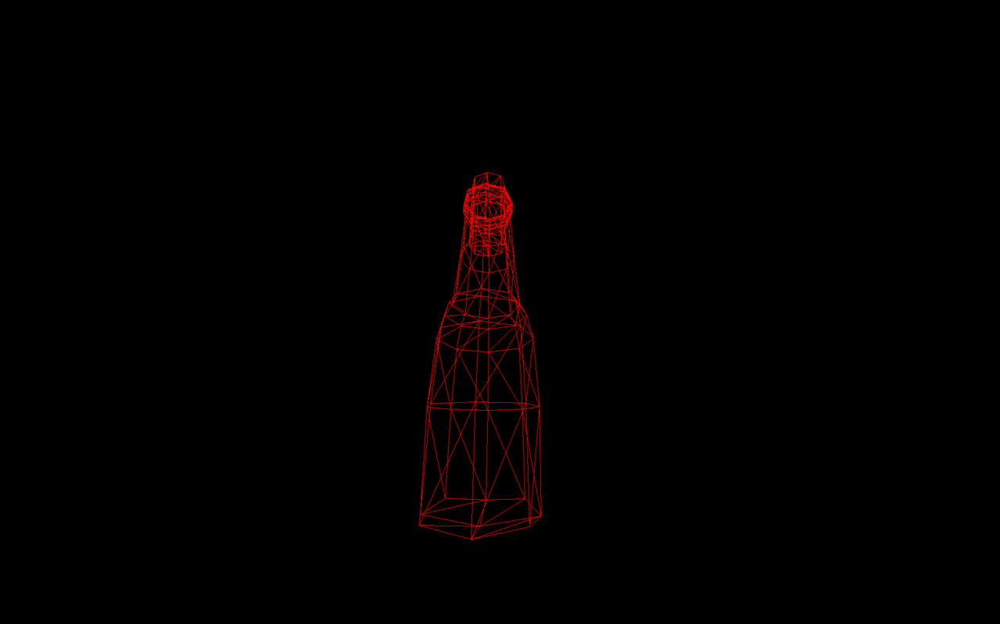

# BottleEngine
Custom C engine made by myself, uses SDL 3.0 to display a window and draw pixels.  
3D Logic made from scratch thanks to Wikipedia documentation.  
Is able to draw simple .obj models.

# Features  
-Move using W/A/S/D (it uses key placement, so non-english keyboards works too)  
-Go up or down using space/shift  
-Move camera using mouse  
-Toggle fullscreen using F11  

# Import model from blender  
-Make your desired model  
-Exported file should not have anything besides meshes (no light or camera neither)  
-Check if there are only quads and triangles  
-Check if there are less than 1000 vertices, faces and triangles  
(each one has a seperate limit)  
-File>Export>Wavefront (Obj)  
-Disable UV Coordinates  
-Disable Normals  
(Check selection by safety)
-Click "Export Wavefront OBJ

# Screenshots
Below are screenshots of the default model

